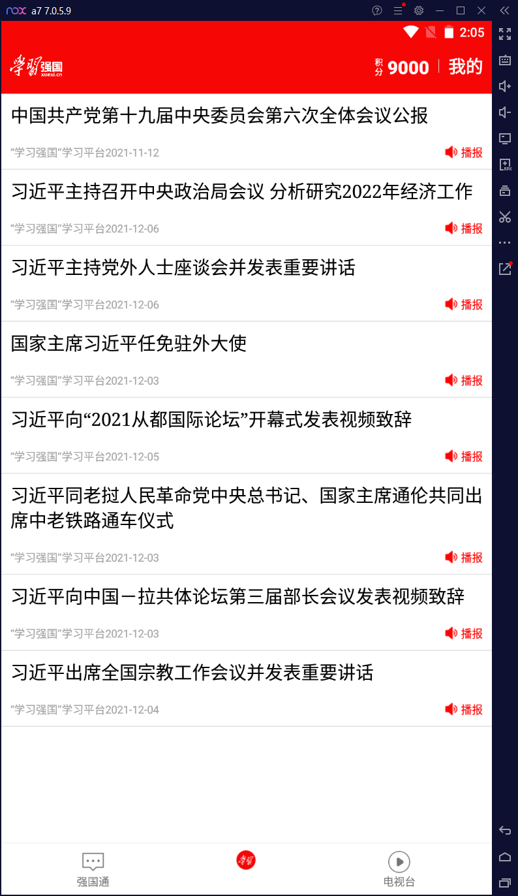
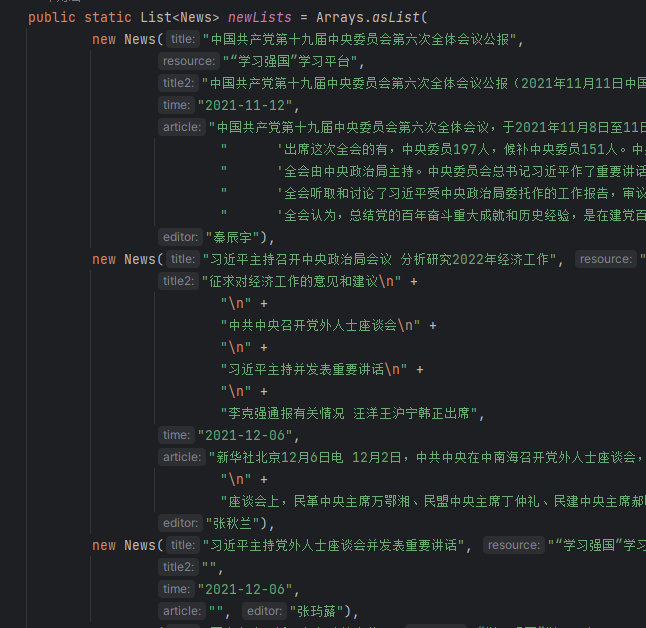
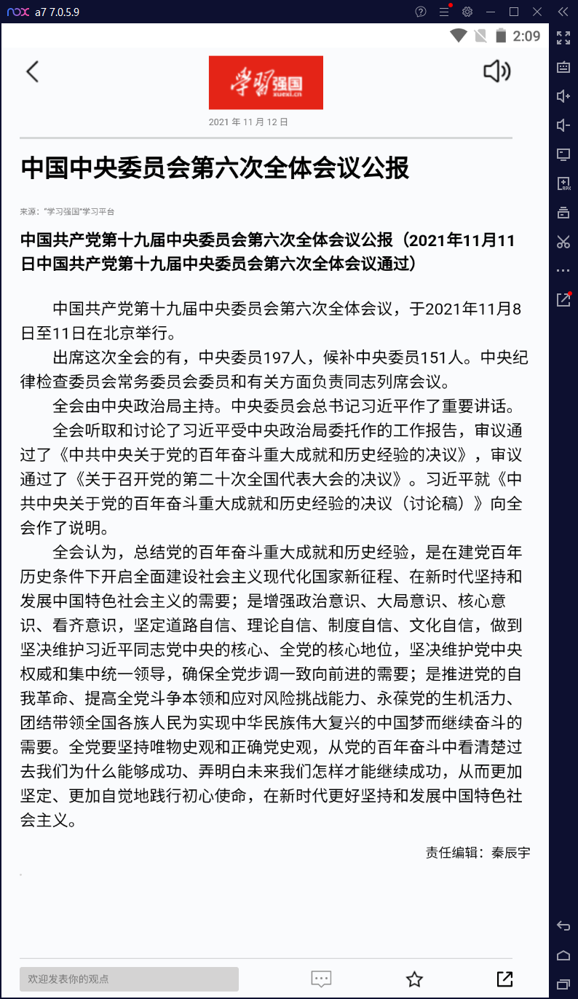
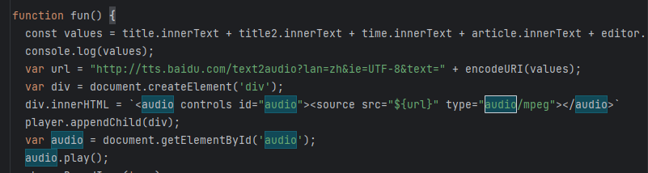

这里的构建思路如下：

首先这个listView的页面我不多说，其数据源是在java/ui/dashboard文件里面，是一个fragment，点进去就可以看到数据

然后给listView的每个item进行绑定点击事件，跳到webView里面去

webView.java进来的时候会进行拿到intent的数据，并且让webview进行加载asset/index.html。从而将页面渲染出来

其中这里所有的按钮都是假的，除了右上角的播放

右上的播放点击后会调用index.js内的fun函数，进行往页面插入一个audio标签，并且调用audio.play()进行播放音频，当然，这个功能也是没实现的。是个假的，这里的音频的资源，是进行百度拼接的

