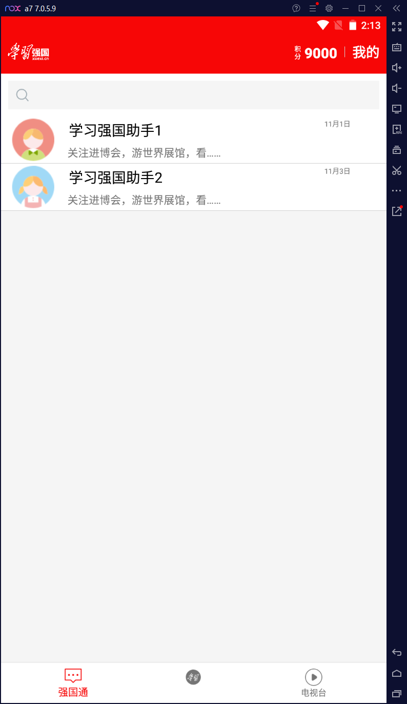
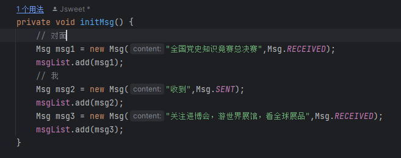

这个页面也是用listView实现的，具体请看java/ui/home下的文件

点进去后，可以看到一个聊天的情况

设置了一个msg的类和msg的适配器，通过new Msg()第二个参数传递不同的类型实现两个用户的情况看

然后进行针对发送按钮监听点击事件，发送的时候new Msg 传递为Msg.SENT的类型，再notifyDataSetChanged一下就可以实现这种聊天的效果了。但是这只是个假的，这些数据都是假的，也只能自己发，对面回不了的