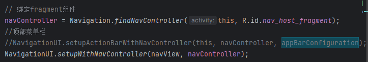
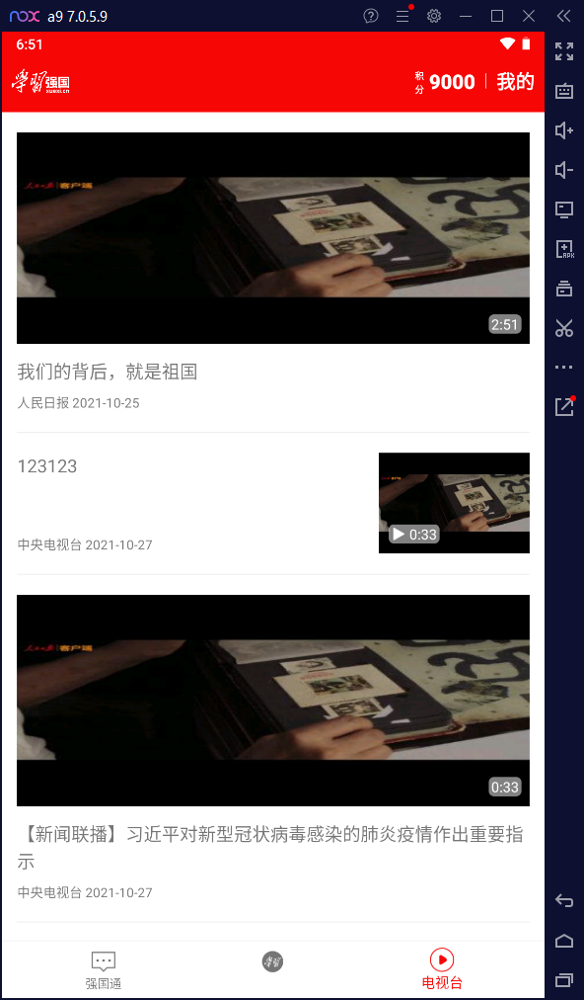
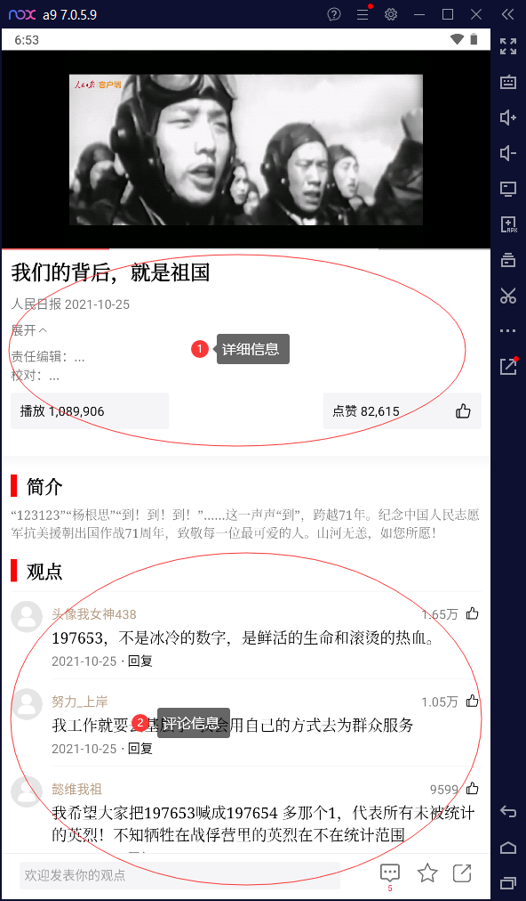
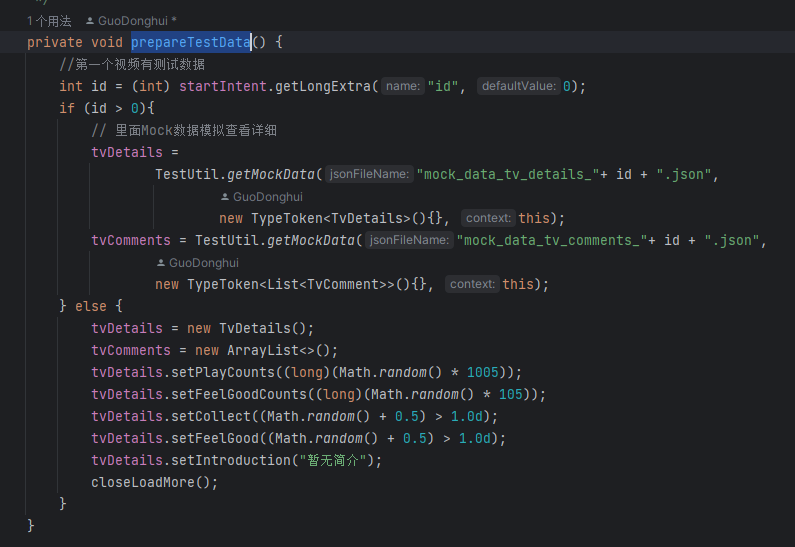
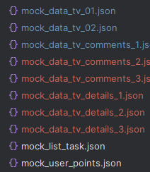

## 如何看一个软件的构成？

1. 寻找数据源：数据从哪来，数据在哪被修改了，数据展示在哪？
2. 数据怎么展示和存储的：数据依靠什么方法展示，利用了什么组件

### 导航栏

由navigation + fragment组成

**主要xml文件**

+ layout/active.main_xml
+ navigation/mobile_navigation
+ menu/bottom_nav_menu

**事件跳转的实现**

关键代码如下：知识点是navigation + fragment的使用

### 电视台

这里利用到了JzvdPlayer + gson

数据是假数据，也就是mock数据，存在于asset目录下的json文件中

+ mock_data_tv_01：这个json文件是用来存放列表的，如图，是这些资源的数据

+ mock_data_details和mock_data_comments是用来存每一项的详细信息和评论信息的

其中针对这些json文件数据的获取是在java/util/TestUi里面

+ getTVStationsPaging：获取列表信息，也就是mock_data_tv的信息
+ getMockData：获取json文件信息，他是在java/TvStationPlayPage里的prepareTestData这个方法里面进行调用的，这里我做了点小处理，通过intent携带进来的数据，拿到这个数据的id然后查对应文件，进行拼接

​	对应这个目录下的这些文件

这里的一个工作流是这样的：

1. 在java/ui/NotificationsFragment下里面有个MyOnLoadMoreRefreshListener的类，里面写了一个listener方法，会进行调用TestUi下的getTVStationsPaging进行读取mock数据

> 这里涉及到了一个refreshLayout组件的使用，在layout/fragment_notification里面使用了。可以百度一下了解一下。其中针对这个组件设置了两个监听器，一个是onload的时候，也就是刚刚加载的时候，另外一个是下拉时候的监听器。详细见java/ui/NotificationsFragment中的eventListener方法

2. 当进入页面后，会触发refresh的onLoad钩子，然后拿到数据后，会进行对listView的item进行一个事件绑定，绑定的内容是将当前item的数据打包到一起并且跳入到详细页面

> 这里的item有两种类型，一种是图片会占满屏幕，一种是图片只会在最右边，对应mock_data_tv_01里面的itemType字段。这里listView的数据绑定是在java/adaper/TVStationAdapter下buildTVStationViewHolder方法里面进行执行的

3. 进入详细页后，就会调用prepareTestData方法，进行获取详细信息和评论信息，除了这些，这里还有个JzvdPlayer，用来播放视频，是在initPlayer方法中进行setUrl，并且startVideo进行播放

> 这里可能需要稍微了解一下JzvdPlayer怎么用。所以需要学习一下这个JzvdPlayer

